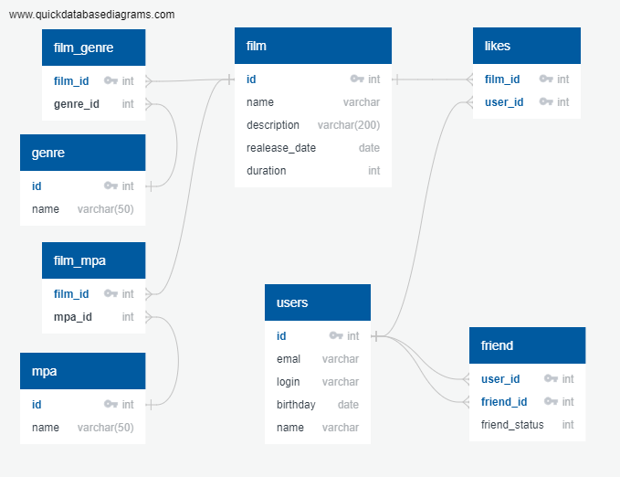

# java-filmorate
Repository for Filmorate project.

### Схема DB

### Примеры запросов DB
- получение списка всех пользователей
```postgres-psql
SELECT * FROM user;
```
- получение информации о пользователе по `id`
```postgres-psql
SELECT * FROM user WHERE id = ?;
```
- получение списка друзей пользователя
```postgres-psql
SELECT *
FROM user
WHERE id IN (SELECT f.friend_id
             FROM user u
             JOIN friend f ON u.id = f.user_id
             WHERE u.user_id = ?);
```
- получение списка всех фильмов
```postgres-psql
SELECT * FROM film;
```
- получение информации о фильме по `id`
```postgres-psql
SELECT * FROM film WHERE id = ?;
```
-получение списка фильмов и их жанров
```postgres-psql
SELECT f.name,
       g.name
FROM film f
LEFT JOIN film_genre fg ON f.id = fg.film_id
LEFT JOIN genre g ON fg.genre_id = g.id;
```
-получение списка популярных фильмов по лайкам
```postgres-psql
SELECT f.name,
       count(f.name) as likes
FROM film f
LEFT JOIN like l ON f.id = l.film_id
GROUP BY f.name
ORDER BY count(f.name) DESC;
```